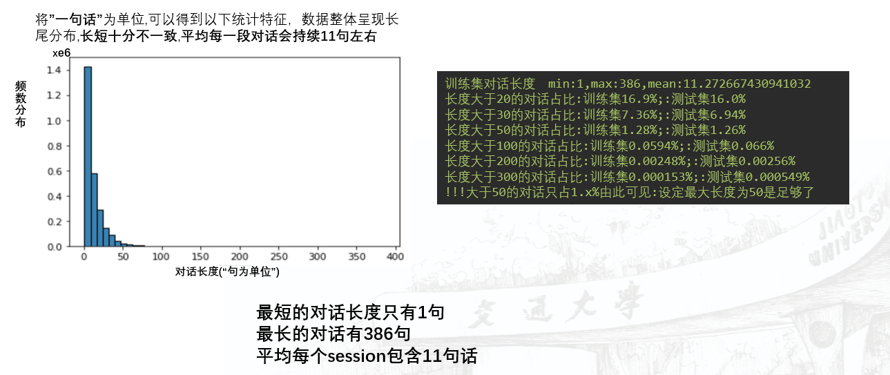
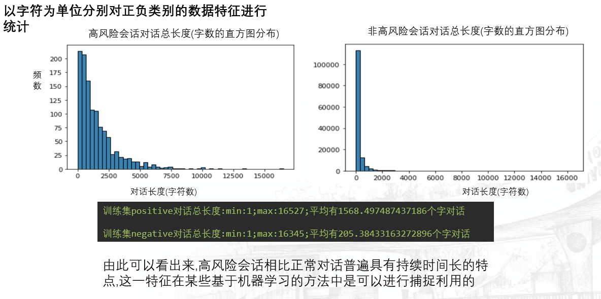
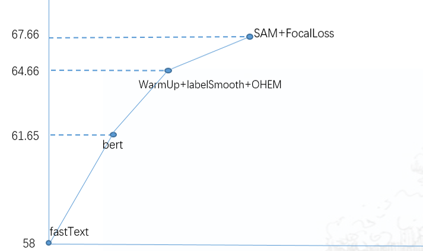

# 马上消费--AI+智能质检
1、赛题背景：随着呼叫中心发展，规模与日俱增。呼叫中心语音数据体量大，是典型的非结构化数据。目前大多数呼叫中心质检仍然依靠人工方式，存在覆盖率低、价值低廉、效率低下以及质检标准不统一等诸多问题。
2、初赛任务：针对语音客服通话数据进行投诉舆情风险发现，预测投诉舆情风险高的会话。

**正负样本极度不均衡的文本二分类问题！！！**

### 1 数据分析:
以”一句话”为单位,可以得到以下统计特征，数据整体呈现长尾分布,长短十分不一致,平均每一段对话会持续11句左右

以字符为单位分别对正负类别的数据特征进行统计

**数据特点:**
- 对话长短不一，特别是超长对话,给模型带来较大困难
- 高风险的会话只存在于对话中的部分位置
- 正负样本极端不均衡

所以针对数据的预处理主要是重新构建合适长度的训练集:经过前面分析,以单句话为单位进行分类会存在很大的问题(标签无法准确给定),如果以Session为单位又太长,正类对话平均1500字,负类也有200字，这超过了大多数模型的表征范围，因此需要将对话进行分组，经实验:8句话分为一个组会取得较好的分类效果

### 2 模型

 - Bert-base-Chinese模型（huggFace）a榜线上单模65.41

 - Chinese-BERT-wwm (哈工大)  a榜线上单模67.67(最终之选)

### 3 模型预测
根据前面所述:原始数据将会以8句话为单位分组 。那么在对于一个Session进行预测的时候,一个session会被拆分成多个样本送给模型,例如一个测试会话有m句话,会被分成n=m/8段分别送给模型,得到n个结果。
对于这十个结果的处理我采取的方式如下:
对所有n个结果（高风险概率）从高到低进行排序
选取Top K的结果取平均
取K=3的时候实验效果最好

**这样处理的优点:**
- 规避数据长短不一的问题

- 高风险会话只存在于一段对话的一些局部,排序取top k的平均相当于只注意到这个局部,这也可以算一种人为Attention的手段

### 4 闯关赛题

中文语音->文字

