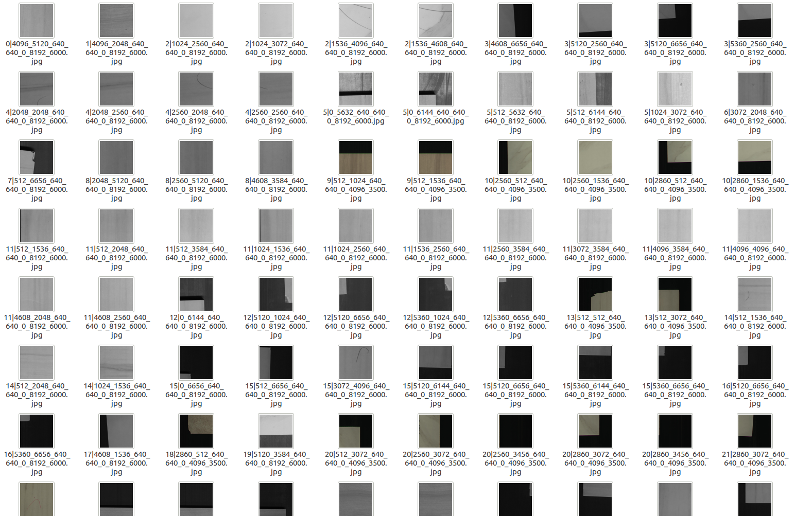
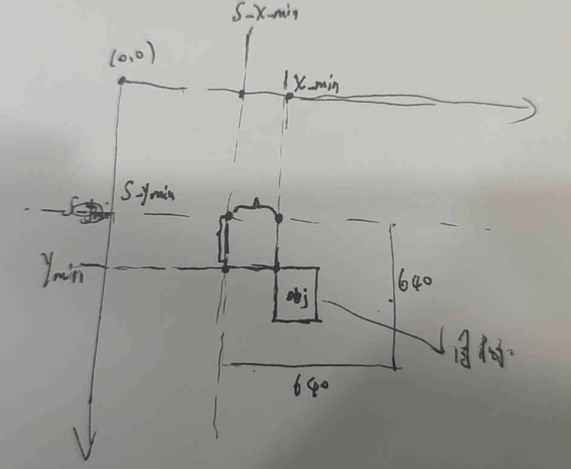
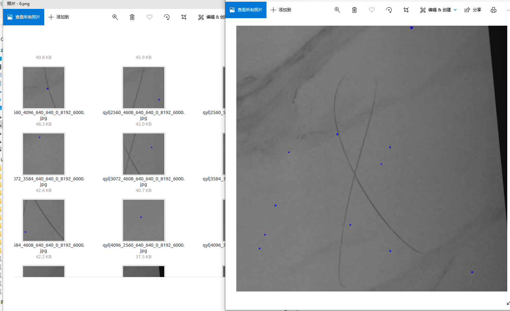

## [2021广东工业智造创新大赛—智能算法赛](https://tianchi.aliyun.com/competition/entrance/531846/introduction)

大赛数据覆盖到了瓷砖产线所有常见瑕疵，包括粉团、角裂、滴釉、断墨、滴墨、B孔、落脏、边裂、缺角、砖渣、白边等。初始的标注格式较为零散，为了便于快速构建模型同时更加方便的使用mmdetection这种开源框架。这里给出将原始数据转化为voc,coco标准格式的代码。只需要更改数据读取和保存路径即可运行!

## convert_to_voc.py

该脚本将原始的标注文件转化为voc格式的数据，方便大多数开源框架的训练

## voc_to_coco.py

将上面转换好的voc数据转换为coco数据集的标准格式,方便快速构建训练pipeline

## yolo系列的数据格式

[参见本人的另一个repo](https://github.com/DLLXW/objectDetectionDatasets)

今天刚参见比赛，只是对数据进行了一个简单的转换和处理,后续如果条件合适,会在本仓库继续开源本比赛的baseline

## 切图操作思路分享
鉴于很多朋友在讨论如何切图，存在的主要问题是训练的时候切图需要考虑标签的几何变化,测试时候切图需要考虑如何拼接起来，经过一下午的研究，实现了整个流程。这里开源下解决思路：

(本来训练时候的切图可以利用一些成熟的框架:比如mmdet来在线进行crop，但是毕竟原图太大,很容易切出背景区域,并且太大的原图会消耗太多的cpu时间,导致极度拖慢训练时间,所以gpu不行cpu更不行的我只能考虑离线切好图和标签)

#### 参考卫星图像目标检测处理方法。

假设:

- 待切的原图大小为:h=6000,w=8192.
- overlop比例:0.2

- 则步长为512.
- 从原图左上角开始切图,切出来图像的左上角记为x,y,
- 那么可以容易想到y依次为:0,512,1024,....,5120.但接下来却并非是5632,因为5632+640>6000,所以这里要对切图的overlop做一个调整,最后一步的y=6000-640.(这是最关键的一点！！！)

#### 关于标签的变化

根据上面的切图思路,目标的标签:x_min,y_min,x_max,y_max要分配给每一个被切出来的小图(640x640)，剩下的图当做背景过滤掉。

假设:

- 当前"小图"的左上角坐标在原图中的位置为:s_x_min,s_y_min.
- 原图上面有一个框的坐标为:x_min,y_min,x_max,y_max.
- 如果该框在该"小图"内部(这个根据坐标很好判断),
  - 则该框相对于该"小图"的新坐标:x_min-s_x_min,y_min-s_y_min

以上便为全过程。

**可视化证明标签变化正确:**

#### 关于推理

推理部分没有标签的变化,主要需要考虑的是将切好的图进行预测后再拼起来,这个操作实质上是上面的逆向操作。反过来就行，完事之后再来一个整体的NMS即可!

关于代码:等后面把整个baseline做好了再开源吧,ps：如果有算力的大佬愿意合作的请加我github主页微信
